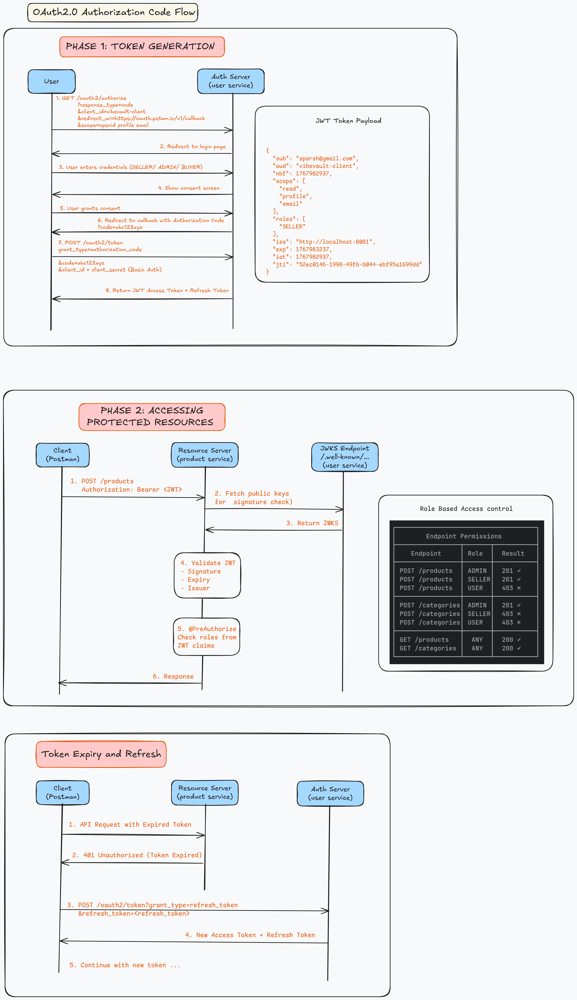

# User Service

## Table of Contents
- [Overview](#overview)
- [Authentication Implementations](#authentication-implementations)
  - [JJWT Implementation](#jjwt-implementation-jjwt-auth-branch)
  - [OAuth2 Authorization Server](#oauth2-authorization-server-implementation-main-branch)
- [Features](#features)
- [Technologies Used](#technologies-used)
- [Setup Instructions](#setup-instructions)
  - [Prerequisites](#prerequisites)
  - [Environment Variables](#environment-variables)
  - [Steps](#steps)
- [API Endpoints](#api-endpoints)
  - [JJWT Authentication Endpoints](#jjwt-authentication-endpoints)
  - [OAuth2 Authorization Server Endpoints](#oauth2-authorization-server-endpoints)
  - [Role Management](#role-management)
- [Architecture](#architecture)
  - [Security Filter Chain](#security-filter-chain)
  - [Implementation Comparison](#implementation-comparison)
- [Database Migrations](#database-migrations)
- [Testing](#testing)
- [References](#references)
- [License](#license)

## Overview

User Service is a Spring Boot application designed to manage user authentication, authorization, and role-based access control. It provides APIs for user signup, login, logout, and role management with support for admin functionalities.

This service supports **two authentication implementations**:

1. **JJWT Implementation** ([`jjwt-auth`](https://github.com/spa-raj/userservice/tree/jjwt-auth) branch) - Self-managed JWT authentication using the [jjwt library](https://github.com/jwtk/jjwt) with symmetric HMAC keys
2. **OAuth2 Authorization Server** (`main` branch) - Full OAuth2/OpenID Connect 1.0 compliant authorization server using Spring Security

Both implementations can coexist, allowing backward compatibility while supporting modern OAuth2 clients.

## Authentication Implementations

### JJWT Implementation (jjwt-auth Branch)

The JJWT implementation provides a self-managed JWT authentication system using symmetric HMAC-SHA512 keys.

**How it works:**
1. User authenticates via `/auth/login` with email and password
2. Server generates/reuses a symmetric HMAC key stored in the database
3. JWT token is created with claims (email, roles, key ID)
4. Token and session are stored in the database
5. Subsequent requests are validated by verifying the JWT signature and session status

**Key characteristics:**
- **Key Type**: Symmetric (HMAC-SHA512)
- **Key Storage**: Per-user keys stored in `jwt` table with expiration
- **Session Management**: Tokens stored in `sessions` table with status tracking
- **Token Validation**: Signature verification + session lookup + claim validation

### OAuth2 Authorization Server Implementation (main Branch)

The OAuth2 implementation provides a full-fledged authorization server compliant with RFC 6749 and OpenID Connect 1.0.

**Supported OAuth2 Flows:**
- **Authorization Code Flow**: Standard flow for web applications
- **Client Credentials Flow**: For service-to-service authentication
- **Refresh Token Flow**: For token renewal without re-authentication

**Key characteristics:**
- **Key Type**: Asymmetric (RSA 2048-bit)
- **Key Discovery**: JWKS endpoint for public key distribution
- **Scope Support**: OpenID, profile, email, and custom scopes (read, write)
- **Consent Management**: User consent tracking for third-party applications
- **Token Types**: Access tokens, refresh tokens, and OIDC ID tokens
- **Metadata Discovery**: Standard well-known endpoints

**OAuth2.0 Flow Diagram:**



## Features

### Core Features
- User registration and login
- User authentication and authorization
- Token validation and revocation
- User logout
- Role-based access control
- Admin functionalities for role management

### JJWT-Specific Features
- Per-user symmetric key generation
- Session-based token tracking
- Key rotation with expiration

### OAuth2-Specific Features
- OpenID Connect 1.0 support
- Multiple grant type support
- Token introspection and revocation
- Client registration and management
- User consent management
- JWKS endpoint for key distribution

## Technologies Used

- Java 21
- Spring Boot 4.x
- Spring Security
- Spring Authorization Server (OAuth2)
- Spring Data JPA / Hibernate
- Flyway for database migrations
- MySQL
- JJWT Library 0.12.6 (for legacy authentication)
- Lombok
- Apache Commons Lang3
- Spring Boot Actuator
- Spring Boot DevTools

## Setup Instructions

### Prerequisites
- Java 21
- Maven
- MySQL database

### Environment Variables

Configure the following environment variables for the application:

| Variable | Description | Required |
|----------|-------------|----------|
| `PORT` | Server port | Yes      |
| `DB_URL` | Database JDBC URL (e.g., `jdbc:mysql://localhost:3306/userservice`) | Yes      |
| `DB_USERNAME` | Database username | Yes      |
| `DB_PASSWORD` | Database password | Yes      |
| `ADMIN_EMAIL` | Initial admin user email | Yes      |
| `ADMIN_PASSWORD` | Initial admin user password | Yes      |
| `ADMIN_FIRST_NAME` | Admin user first name | Yes      |
| `ADMIN_LAST_NAME` | Admin user last name | Yes      |
| `CLIENT_ID` | OAuth2 client identifier | Yes      |
| `CLIENT_SECRET` | OAuth2 client secret | Yes      |
| `REDIRECT_URI` | OAuth2 redirect URI | Yes      |

### Steps

1. Clone the repository:
   ```bash
   git clone https://github.com/spa-raj/userservice.git
   ```

2. Navigate to the project directory:
   ```bash
   cd userservice
   ```

3. Choose your branch:
   ```bash
   # For OAuth2 Authorization Server implementation (recommended)
   git checkout main

   # For JJWT implementation
   git checkout jjwt-auth
   ```

4. Set the required environment variables. Example using export:
   ```bash
   export PORT=8081
   export DB_URL=jdbc:mysql://localhost:3306/userservice
   export DB_USERNAME=your_username
   export DB_PASSWORD=your_password
   export ADMIN_EMAIL=admin@example.com
   export ADMIN_PASSWORD=your_admin_password
   export ADMIN_FIRST_NAME=Admin
   export ADMIN_LAST_NAME=User
   export CLIENT_ID=vibevault-client
   export CLIENT_SECRET=your_client_secret
   export REDIRECT_URI=https://oauth.pstmn.io/v1/callback  # Postman callback for testing
   ```

5. Build and run the application:
   ```bash
   mvn spring-boot:run
   ```

## API Endpoints

### JJWT Authentication Endpoints

These endpoints are available in the `jjwt-auth` branch and also in `main` for backward compatibility.

#### POST /auth/signup
Register a new user.

**Request Body:**
```json
{
  "email": "user@example.com",
  "name": "John Doe",
  "password": "securepassword",
  "phone": "1234567890",
  "role": "seller"
}
```

**Response:**
```json
{
  "userEmail": "user@example.com",
  "name": "John Doe",
  "phone": "1234567890",
  "role": "Role{name='SELLER', description='The seller/merchant of our products.'}"
}
```

#### POST /auth/login
Authenticate a user and return a JWT token.

**Request Body:**
```json
{
  "email": "user@example.com",
  "password": "securepassword"
}
```

**Response:**
```json
{
  "status": 200,
  "token": "eyJraWQiOiIyMmNiZjZlZS1...",
  "sessionId": "fc4f9769-6683-412a-9865-a094a7a2151e"
}
```

#### POST /auth/validate
Validate a user's token.

**Request Headers:**
```
Authorization: eyJhbGciOiJIUzI1NiIsInR5cCI6IkpXVCJ9...
```

**Response:**
```json
{
  "status": 200,
  "email": "user@example.com",
  "name": "John Doe",
  "phone": "1234567890",
  "roles": ["SELLER"]
}
```

#### POST /auth/logout
Logout a user and invalidate the token.

**Request Body:**
```json
{
  "userEmail": "user@example.com",
  "token": "eyJhbGciOiJIUzI1NiIsInR5cCI6IkpXVCJ9..."
}
```

**Response:**
```json
{
  "status": 204,
  "message": "No Content"
}
```

### OAuth2 Authorization Server Endpoints

These endpoints are available only in the `main` branch (OAuth2 implementation).

#### GET /oauth2/authorize
Initiates the OAuth2 authorization code flow.

**Query Parameters:**

| Parameter | Description |
|-----------|-------------|
| `client_id` | The registered client identifier |
| `response_type` | Must be `code` for authorization code flow |
| `scope` | Space-separated list of scopes (e.g., `openid profile email`) |
| `redirect_uri` | Callback URL for the authorization code |
| `state` | Optional state parameter for CSRF protection |

**Example:**
```
GET /oauth2/authorize?client_id=vibevault-client&response_type=code&scope=openid%20profile&redirect_uri=http://127.0.0.1:8080/callback&state=xyz
```

#### POST /oauth2/token
Exchange authorization code for tokens or request tokens directly.

**Authorization Code Grant:**
```bash
curl -X POST http://localhost:8081/oauth2/token \
  -H "Content-Type: application/x-www-form-urlencoded" \
  -u "vibevault-client:client-secret" \
  -d "grant_type=authorization_code" \
  -d "code=AUTHORIZATION_CODE" \
  -d "redirect_uri=http://127.0.0.1:8080/callback"
```

**Client Credentials Grant:**
```bash
curl -X POST http://localhost:8081/oauth2/token \
  -H "Content-Type: application/x-www-form-urlencoded" \
  -u "vibevault-client:client-secret" \
  -d "grant_type=client_credentials" \
  -d "scope=read write"
```

**Response:**
```json
{
  "access_token": "eyJraWQiOi...",
  "refresh_token": "abc123...",
  "token_type": "Bearer",
  "expires_in": 3600,
  "scope": "openid profile",
  "id_token": "eyJhbGciOi..."
}
```

#### POST /oauth2/introspect
Introspect a token to check its validity.

```bash
curl -X POST http://localhost:8081/oauth2/introspect \
  -u "vibevault-client:client-secret" \
  -d "token=ACCESS_TOKEN"
```

#### POST /oauth2/revoke
Revoke an access or refresh token.

```bash
curl -X POST http://localhost:8081/oauth2/revoke \
  -u "vibevault-client:client-secret" \
  -d "token=ACCESS_TOKEN"
```

#### GET /oauth2/jwks
Retrieve the JSON Web Key Set for token verification.

**Response:**
```json
{
  "keys": [
    {
      "kty": "RSA",
      "e": "AQAB",
      "use": "sig",
      "kid": "key-id",
      "alg": "RS256",
      "n": "..."
    }
  ]
}
```

#### GET /.well-known/oauth-authorization-server
OAuth2 authorization server metadata.

#### GET /.well-known/openid-configuration
OpenID Connect discovery document.

### Role Management

These endpoints require admin authentication.

#### POST /roles/create
Create a new role.

**Request Body:**
```json
{
  "roleName": "BUYER",
  "description": "This role is for buyers who purchase products."
}
```

**Response:**
```json
{
  "status": 201,
  "roleName": "BUYER",
  "description": "This role is for buyers who purchase products.",
  "message": "Role created successfully"
}
```

#### POST /roles/update
Update an existing role.

**Request Body:**
```json
{
  "roleName": "BUYER",
  "description": "Updated description for the buyer role."
}
```

#### GET /roles
Get all roles.

**Response:**
```json
{
  "status": 200,
  "roles": [
    {
      "roleId": "uuid...",
      "name": "SELLER",
      "description": "The seller/merchant of our products."
    },
    {
      "roleId": "uuid...",
      "name": "BUYER",
      "description": "This role is for buyers who purchase products."
    }
  ]
}
```

#### GET /roles/{roleId}
Get a specific role by ID.

## Architecture

### Security Filter Chain

The OAuth2 implementation uses a three-tier security filter chain:

```
┌─────────────────────────────────────────────────────────────┐
│                     Incoming Requests                       │
└─────────────────────────────────────────────────────────────┘
                              │
          ┌───────────────────┼───────────────────┐
          ▼                   ▼                   ▼
┌─────────────────┐ ┌─────────────────┐ ┌─────────────────┐
│  Order 1        │ │  Order 2        │ │  Order 3        │
│  OAuth2 Server  │ │  API Resource   │ │  Default        │
│                 │ │  Server         │ │  Security       │
├─────────────────┤ ├─────────────────┤ ├─────────────────┤
│ /oauth2/*       │ │ /auth/*         │ │ All other       │
│ /.well-known/*  │ │ /api/*          │ │ endpoints       │
├─────────────────┤ ├─────────────────┤ ├─────────────────┤
│ OIDC enabled    │ │ JWT validation  │ │ Form login      │
│ CSRF disabled   │ │ CSRF disabled   │ │ Session-based   │
│ Stateless       │ │ Stateless       │ │                 │
└─────────────────┘ └─────────────────┘ └─────────────────┘
```

### Implementation Comparison

| Aspect | JJWT | OAuth2 Authorization Server |
|--------|------|------------------------------|
| **Standard** | Custom JWT | RFC 6749, OpenID Connect 1.0 |
| **Key Type** | Symmetric (HMAC-SHA512) | Asymmetric (RSA 2048-bit) |
| **Key Storage** | Per-user in database | In-memory (restart regenerates) |
| **Grant Types** | Direct authentication | Authorization Code, Client Credentials, Refresh Token |
| **Scope Support** | No | Yes (openid, profile, email, custom) |
| **Consent Management** | No | Yes |
| **Key Discovery** | N/A | JWKS endpoint |
| **Token Revocation** | Manual (logout) | Built-in endpoint |
| **Third-party Integration** | Limited | Full OAuth2 ecosystem |

### Database Schema

**JJWT Tables:**
- `users` - User accounts
- `roles` - Role definitions
- `user_roles` - User-role mappings
- `sessions` - Active session tracking
- `jwt` - JWT signing keys

**OAuth2 Tables (additional):**
- `client` - Registered OAuth2 clients
- `authorization` - OAuth2 authorization records and tokens
- `authorization_consent` - User consent grants

## Database Migrations

Flyway is used for managing database schema migrations. Migration scripts are located in `src/main/resources/db/migration`.

| Migration | Description |
|-----------|-------------|
| V1 | Base schema (users, roles, user_roles) |
| V2 | JWT tables (sessions, jwt) |
| V3 | Additional user fields |
| V4 | Reserved for future use |
| V5 | OAuth2 tables (client, authorization, authorization_consent) |

## Testing

The application includes comprehensive unit and integration tests.

### Controller Tests
- **AuthControllerTest**: Validates authentication endpoints
- **AuthControllerMVCTest**: Mock MVC tests for authentication
- **RoleControllerTest**: Tests role management endpoints
- **RoleControllerMVCTest**: Mock MVC tests for role management

### Service Tests
- **AuthServiceTest**: Tests authentication service logic
- **KeyLocatorImplTest**: Validates JWT key locator implementation
- **RoleServiceTest**: Tests role service logic

### Code Quality
SonarQube integration is planned for code quality and coverage analysis.

## References

- [JJWT Library](https://github.com/jwtk/jjwt)
- [Spring Authorization Server](https://docs.spring.io/spring-authorization-server/reference/index.html)
- [OAuth 2.0 RFC 6749](https://datatracker.ietf.org/doc/html/rfc6749)
- [OpenID Connect Core 1.0](https://openid.net/specs/openid-connect-core-1_0.html)

## Known Issues

- **RSA Key Persistence**: In the OAuth2 implementation, RSA keys are regenerated on application restart, invalidating existing tokens. See [GitHub Issue #25](https://github.com/spa-raj/userservice/issues/25) for tracking.

## License

This project is licensed under the Apache-2.0 License. See the LICENSE file for details.
